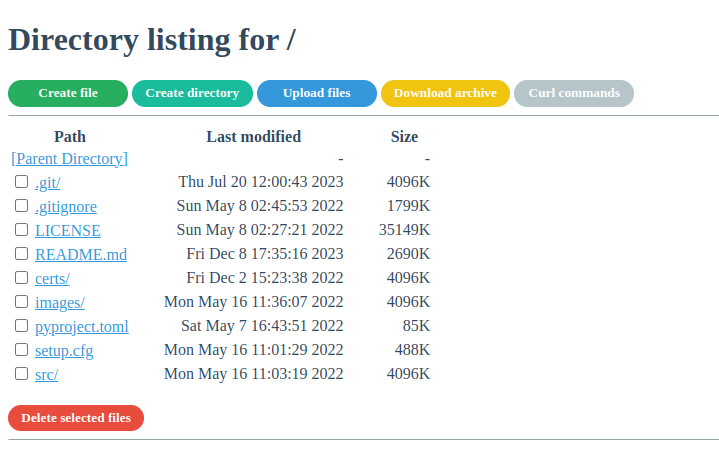

# HTTPY

Simple HTTP server to list and manipulate files.

The objective of this project is to replace the [http.server](https://docs.python.org/3/library/http.server.html) python module with a [Flask](https://flask.palletsprojects.com/) server offering more features:
- Basic Authentication
- Directory listing
- Files upload and download
- Files and directories creation
- Files and directories deletion
- SSL encryption (HTTPS)

## Install

Clone the repository, go inside and then:
```bash
git clone https://github.com/WhatTheSlime/httpy.git
cd httpy
python3 -m pip install .
```

## Basic usage

1. Start the server:

```bash
httpy --ssl -e
```
```
 * Serving Flask app 'httpy'
 * Debug mode: off
WARNING: This is a development server. Do not use it in a production deployment. Use a production WSGI server instead.
 * Running on all addresses (0.0.0.0)
 * Running on https://127.0.0.1:8000
Press CTRL+C to quit

```

2. Open in browser:




## Use features with curl

*Need `--edit` flag set on the server.* 

```bash
# Download a file:
curl -ski -O http://127.0.0.1:8000/file.ext
```
```bash
# Download archive of directory:
curl -ski -d '' http://127.0.0.1:8000/?action=archive -o archive.zip
```
```bash
# Create a file:
curl -ski http://127.0.0.1:8000/?action=create -d 'name=filename&content=filecontent'
```
```bash
# Create a directory:
curl -ski http://127.0.0.1:8000/?action=mkdir -d name='dirname'
```
```bash
# Upload files:
curl -ski http://127.0.0.1:8000/?action=upload -F file=@'path/to/file1.ext' -F file=@'path/to/file2.ext'
```
```bash
# Delete files:
curl -ski http://127.0.0.1:8000/?action=delete -d 'file1='filename1&file2=filename2'
```

## Generate SSL certificates

```bash
openssl req -x509 -newkey rsa:4096 -nodes -out cert.pem -keyout key.pem -days 365
httpy --ssl --cert cert.pem --key key.pem 
```
